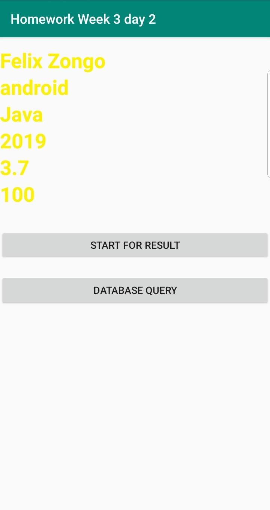

**************** Homework Week 3 day 2 **********************

1.  Make a database for a Student that takes the following items:
          a) Student ID
          b) Student Name
          c) Student major
          d) Student minor
          e) Student expected grad year
          f) Student GPA
          g) Student completed hours
2.  Make a student object to hold info in #1
3.  Implement the crud operation methods.
4.  Implement an activity that will get the info in #1 from the user
5.  Implement an activity that will allow you to query for a student, update a student, and delete a student from the DB
6.  Save the last student queried or inserted id in sharedPrefs
7.  Save every student's id that is queried to a internal storage file (Code online is fixed)

Screenshot1

Screenshot2

Screenshot3

Screenshot4

Screenshot5

      
